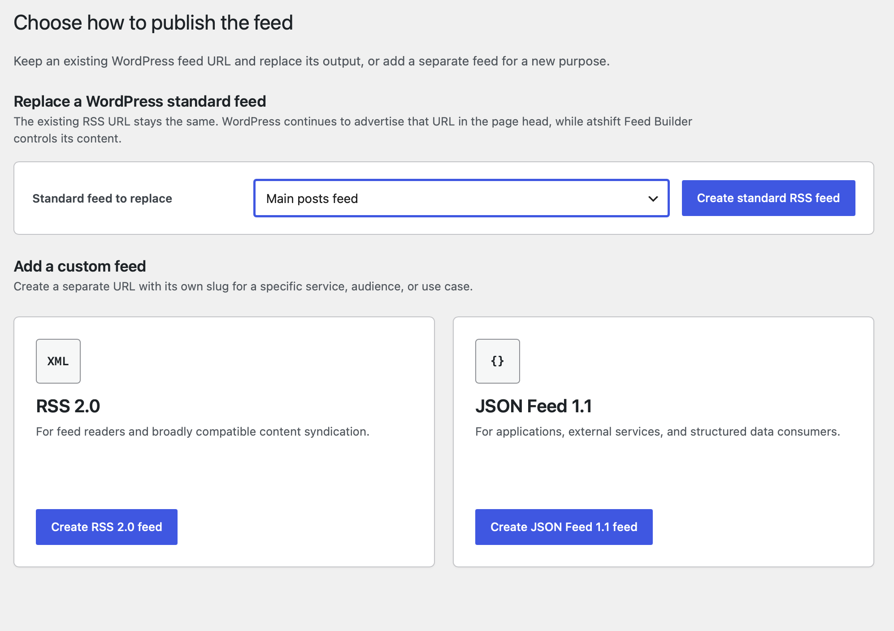
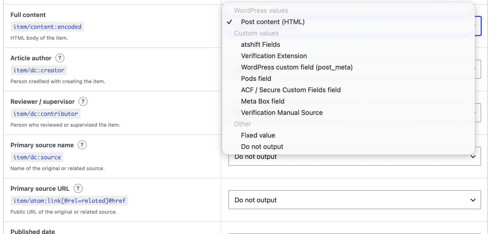
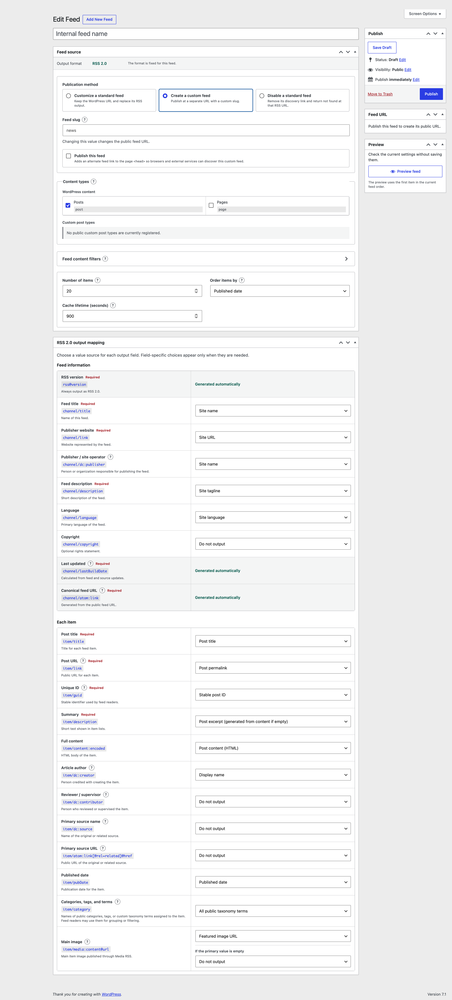
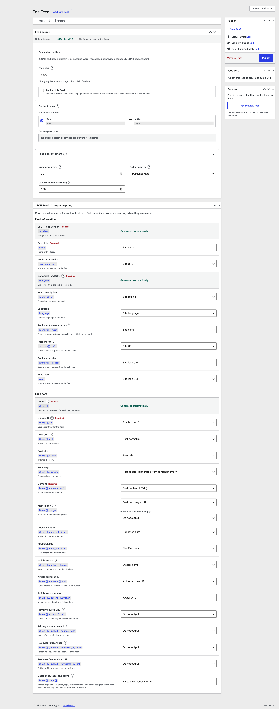

<div align="center">
  
  <h1>atshift Feed Builder</h1>
  <p><strong>Build reliable WordPress feeds for people, services, and AI.</strong></p>
  <p>
    <a href="https://github.com/at-shift/atshift-feed-builder/releases">Releases</a>
    &middot;
    <a href="https://github.com/at-shift/atshift-feed-builder/issues">Issues</a>
  </p>
</div>

atshift Feed Builder turns WordPress posts, custom fields, and author profile data into purpose-specific RSS 2.0 and JSON Feed 1.1 feeds. It works as a standalone plugin and can discover field definitions from supported custom field plugins when they are active.

The current stable release is version 0.3.4. Review every mapping on a staging site before publishing a new feed in production.

## Features

- Create multiple RSS 2.0 and JSON Feed 1.1 configurations
- Customize WordPress standard RSS feeds while preserving their existing URLs
- Create separate feeds with purpose-specific URLs
- Disable selected WordPress standard feeds and their discovery links
- Select posts, pages, and public custom post types
- Filter items by author, public taxonomy terms, and allow-listed custom fields
- Map feed fields to WordPress values, fixed values, atshift Fields, or post-author UPF values
- Read explicitly named fields from post meta, Pods, ACF / Secure Custom Fields, Meta Box, and Carbon Fields
- Map publisher, article author, primary source, and reviewer information independently
- Define a fallback source for the main image
- Preview the first real feed item before saving
- Inspect and copy the generated XML or JSON
- Publish ETag and Last-Modified headers with cached feed output

## Requirements

- WordPress 6.4 or later
- PHP 7.4 or later

atshift Fields, atshift User Profile Fields, and supported third-party field plugins are optional.

## Installation

1. Download the latest ZIP from [GitHub Releases](https://github.com/at-shift/atshift-feed-builder/releases).
2. In WordPress, open **Plugins > Add Plugin > Upload Plugin**.
3. Upload the ZIP and activate **atshift Feed Builder**.
4. Open **atshift Feed Builder > Add New Feed**.

## Getting Started

Choose RSS 2.0 or JSON Feed 1.1 when creating a feed. A feed keeps that output format after it is created, so the editor can show only the fields and choices that belong to the selected standard.

For RSS, choose one publication method:

1. Customize the contents of a WordPress standard feed.
2. Create a custom feed at a separate URL.
3. Disable a selected WordPress standard feed.

Then choose the content types, optional delivery filters, item limit, ordering, and output mappings. The preview uses the first matching published item and does not require saving temporary changes.

## Screenshots

### Choose how to publish



### Map structured values



<details>
<summary>RSS 2.0 feed editor</summary>



</details>

<details>
<summary>JSON Feed 1.1 editor</summary>



</details>

## Feed URLs

Standard RSS customization keeps the WordPress URL for the selected destination. This includes the main posts feed, public custom post type archive feeds, and public taxonomy term feeds.

Custom feeds use a site-owned endpoint without a plugin-name prefix:

```text
/feeds/{feed-slug}/rss/
/feeds/{feed-slug}/json/
```

A custom feed can add an alternate feed link to the page `<head>` so browsers and external services can discover it.

## Value Sources

Every output field uses an explicit value source. Available sources depend on the field and active plugins.

- WordPress site, post, author, taxonomy, and media values
- Fixed values
- atshift Fields field definitions and values
- atshift User Profile Fields definitions and post-author values
- WordPress `post_meta` using an explicitly entered key
- Pods fields using an explicitly entered field name
- ACF / Secure Custom Fields, Meta Box, and Carbon Fields using their public APIs
- Additional adapters registered by another plugin

Fields and UPF values replace selected output fields. They are never appended to a public feed automatically.

## Privacy And Safety

- Only explicitly selected fields are published
- Protected and security-related meta keys are blocked
- Password, authentication, session, token, and capability data cannot be selected
- Fields that may contain personal information are visibly marked
- Draft, private, scheduled, and password-protected posts are excluded
- Unknown third-party values require an explicitly entered public field name or key
- XML and JSON output is encoded for its target format
- Adapter failures and unexpected adapter values are discarded before output

Review every mapping before publishing a feed, especially when user profile fields may contain email addresses, phone numbers, addresses, or other personal information.

## Custom Source Adapters

Plugins can add value sources with the `atshift_feed_builder_source_adapters` filter. An adapter implements `Atshift_Feed_Builder_Source_Adapter` and declares only the public fields it intends to expose.

```php
add_filter(
	'atshift_feed_builder_source_adapters',
	function ( $adapters ) {
		$adapters['example'] = new Example_Feed_Source();
		return $adapters;
	}
);
```

Adapters that accept a manually entered field name can implement `Atshift_Feed_Builder_Manual_Source_Adapter`. They must validate the requested key with `is_allowed_key()` and must not expose protected or secret values.

Supported field types are `string`, `number`, `boolean`, `url`, `image`, `html`, and `list`.

## Related Projects

- [atshift Fields](https://wordpress.org/plugins/atshift-fields-maintenance-for-custom-field-suite/) structures fields for posts and custom post types.
- [atshift User Profile Fields](https://github.com/at-shift/atshift-user-profile-fields) creates and organizes WordPress user profile fields.
- [atshift Freeform Login](https://wordpress.org/plugins/atshift-freeform-login/) designs the WordPress login screen and provides a matching login form shortcode.

## Reporting Issues

Please use [GitHub Issues](https://github.com/at-shift/atshift-feed-builder/issues) and include reproduction steps together with your WordPress, PHP, and plugin versions.

## License

GPL-2.0-or-later
